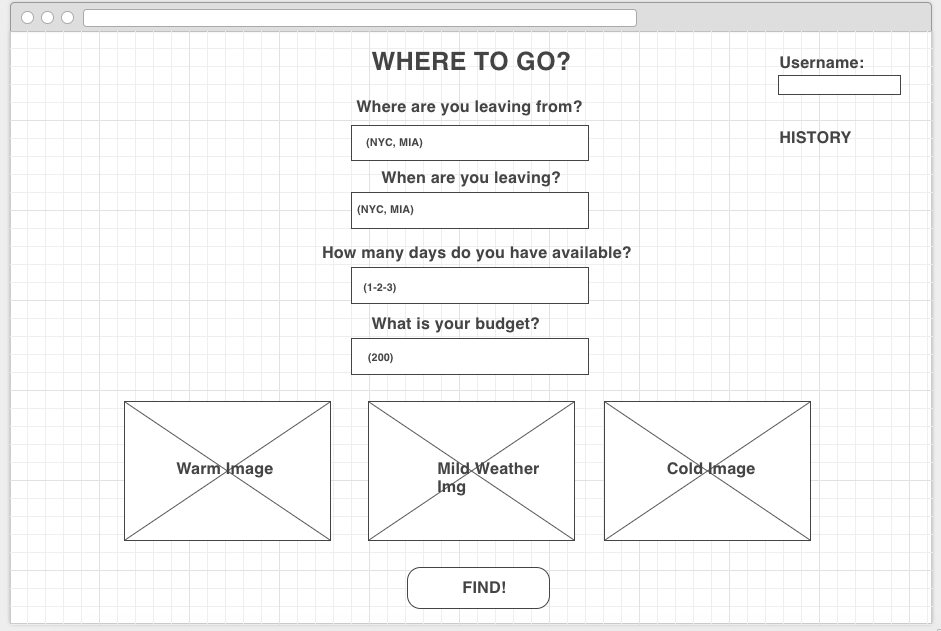

//----Susana Isaza, 10.31.2016----//
//----Flight-Finder-ASAP----//

Links:

Heroky: https://find-flights-asap.herokuapp.com/
GitHub: https://github.com/svall/Flight-Mood

Summary:

The app allows users to search for flights based on an origin city (entered in IATA code), departure date, nuber of days to leave, and budget. 

App process:

Before using the app, a user must create an account to access.
Once a user has signed up creating a username and passowrd, they can proceed to log in.

The user starts in the home page, where they can enter specific search parameters based on their preferences. If they are a returning user, they can access their previous saved flights clicking on the history button.

When performing a search, five resuls will be provided in the search page displaying the destination for each. Clicking on "See Details" will display more info on each search (travel dates, price...). The user has the option to add comments or reminders to a flight before saving it. To save a flight, click on "Save". That saved flight will be accessible in the history page for that user.

In the history page, the user can look through any previous flights saved, as well as delete the trip, and edit the comment/reminder that was added when it was saved.

Wireframes:

Index page:

Log-in / sign-up:

Home page - enter search preferences:

Search results:

User history - saved selected trips:

Approach:

0. Select API and tested get requests.
1. Set up MVC structure, created package.json with necessary dependencies.
2. Connected server.js - routes - views.
3. Created Services, connected to routes.
4. Set up API key, rendered responses on views.
5. Set up models and connected to Mongodb.
6. Saved to Mongodb data from the API response.
7. Displayed saved search to history ejs.
8. Added user sessions.
9. Rerouted connections to Mongodb.
10. Styled with CSS.

Technologies Used:

- API: https://sandbox.amadeus.com/travel-innovation-sandbox/apis/get/flights/inspiration-search
- Database: Mongodb
- Hosting: Heroku --> https://dashboard.heroku.com/apps/find-flights-asap
- Node.js
- Express
- CSS

Attributions & Sources:

1. Users and session structure provided by General Assembly instructors: https://git.generalassemb.ly/wdi-nyc-60/user_auth_itunes
2. Edit & Delete documents in Mongo: https://git.generalassemb.ly/wdi-nyc-60/tom-cruise-movie-db/tree/rafa-solution
3. Add span to html for font-weight and color: http://stackoverflow.com/questions/2728789/how-to-replace-span-style-font-weight-boldfoo-span-by-strongfoo-stron
4. Image background setup: https://css-tricks.com/perfect-full-page-background-image/
5. MVC structure, models and services: https://git.generalassemb.ly/wdi-nyc-60/momentum_clone_lab_solution
6. Adding images to readme.md: http://stackoverflow.com/questions/10189356/how-to-add-screenshot-to-readmes-in-github-repository

Constraints:
1. API with the information needed (especially flight prices).
2. Limiting the city searches to the IATA City Codes.
3. Adding user sessions (structuring it according to my initial setup, landing in the search page instead ot the user history page).

